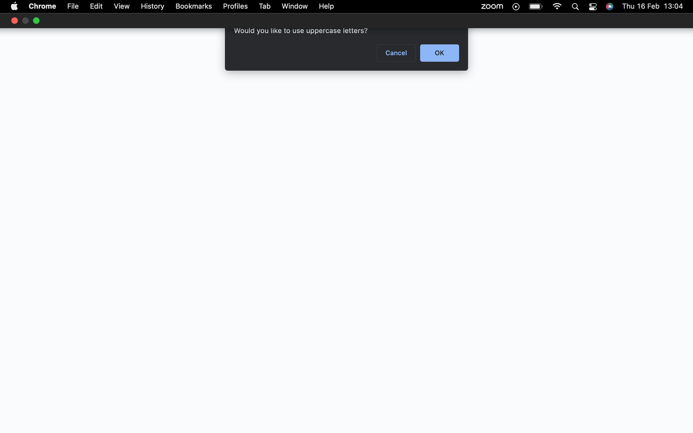

# password-generator

## Description
***
Following a ubiquitous increase in cybercrimes of late, it is now more important than ever to ensure you have a secure password to protect your indentity and personal information online.
This project was created to provide users with an easy solution to creating secure passwords in the click of a button.

## Contents 
***
- Installation
- Usage

## Installation
***
This application does not require any installation as it has been deployed at Github Pages: [Password Generator](https://clagul01.github.io/password-generator/ "Password Generator").

To see how the code is written and works, please check out the appication repository on Github: [Password Generator Repository](https://github.com/Clagul01/password-generator "Repo Link").

## Usage
***
* To use this application, first visit the github pages deployed page here: [Password Generator](https://clagul01.github.io/password-generator/ "Password Generator").

* The following prompt message will appear:

Enter the desired number of characters for the password, and hit ok/enter.

* The browser will next give you four options:

Select 'OK' for this option to include upper cased letters.
***

Select 'OK' for this option to include lower cased letters.
***

Select 'OK' for this option to include numeric characters.
***

Select 'OK' for this option to include special characters.

Once the following options have been selected, you will come to the application's homescreen. 

Press the generate button to be shown your random password:

If you are happy with the password, please copy and use!
If not, hit the generate button again and be shown a new password.
